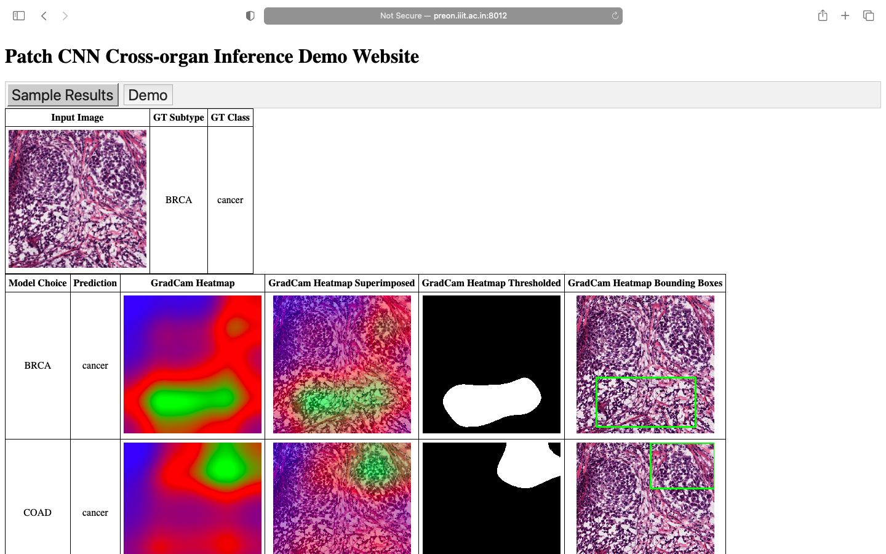
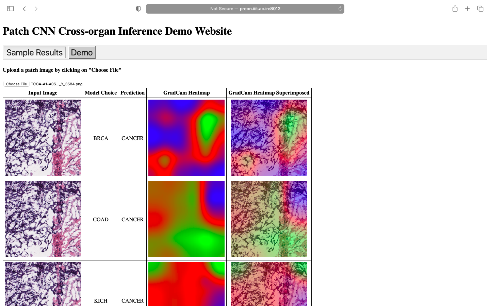

# TCGA Patch-CNN Inference Demo

### Running the app
```
pip3 install gdown flask torch opencv-python matplotlib scikit-learn
gdown https://drive.google.com/uc?id=1mkC8m6nMzP0opNoct5c3qnmpOqlBGa_B
gdown https://drive.google.com/uc?id=1MvVX6fLRYAmnNmmgd6kggcXBnxdt8XAG
unzip ckpts.tar.gz
unzip ckpts.zip - d static/
python3 app.py
```
### Sample Results:


### Demo:

